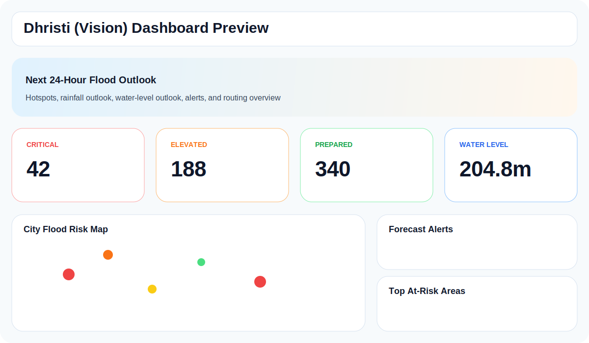
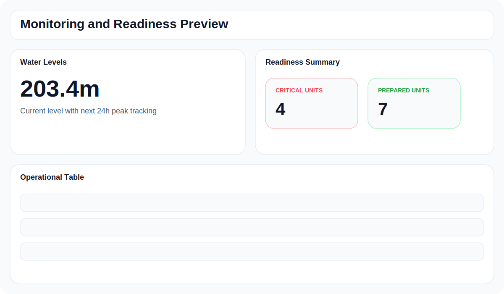

<div align="center">

# Dhristi (Vision)

### Multi-City Flood Prediction and Readiness Platform

[](./data)
[](./python/api.py)
[](./python/api.py)
[](./js)
[](./models)

</div>

Dhristi is a multi-city flood intelligence dashboard focused on **forecast-driven operations**, not just static mapping. It combines a live frontend, a FastAPI backend, city-specific model pipelines, hotspot analysis, water-level monitoring, readiness scoring, alerts, and routing for **Delhi**, **Mumbai**, and **Sikkim**.

The platform is now aligned around a clearly defined **next 24 hours** prediction window:
- current rainfall / water level are shown as live context
- the main flood-risk outputs are interpreted as **forecast risk over the next 24 hours**
- alerts, hotspot severity, simulator outputs, and readiness signals follow the same forecast contract

---

## Preview

| Dashboard Preview | Monitoring Preview |
|---|---|
|  |  |

---

## Table of Contents

- [Why Dhristi](#why-dhristi)
- [Core Capabilities](#core-capabilities)
- [Cities and Data Flows](#cities-and-data-flows)
- [Prediction Horizon](#prediction-horizon)
- [Tech Stack](#tech-stack)
- [Project Structure](#project-structure)
- [Run Locally](#run-locally)
- [API Endpoints](#api-endpoints)
- [Recent Updates](#recent-updates)
- [Notes](#notes)

---

## Why Dhristi

The project originally started as a Delhi-only DFIS prototype. It has since been reworked into **Dhristi (Vision)**, a broader flood prediction and response platform designed to support multiple cities with a more operational workflow.

What changed:
- rebranded from **DFIS** to **Dhristi**
- expanded from **Delhi-only** to **Delhi + Mumbai**
- moved toward **runtime / backend-driven values**
- made the system **forecast-based for the next 24 hours**
- improved routing, maps, readiness views, alerts, and simulator behavior

---

## Core Capabilities

### Forecast Dashboard
- next 24-hour hotspot outlook
- current rainfall with 24-hour rainfall totals / peak context
- current water level with 24-hour peak outlook
- city readiness summary
- live / forecast alerts and top at-risk areas

### Hotspot Intelligence
- city-aware hotspot ranking
- district / ward distribution
- risk level, score, cause, and action
- map-linked hotspot navigation and route handoff

### Readiness and Operations
- readiness scoring from drainage, pumps, roads, response, and preparedness signals
- summarized readiness cards
- filterable readiness table
- resource deployment guidance

### Water-Level Monitoring
- Yamuna-linked water context for Delhi
- Arabian Sea marine-linked water context for Mumbai
- current level plus next 24-hour forecast peak
- gauge / station summaries and nearby impact areas

### Scenario Simulation
- model-backed scenario evaluation
- forecast-style rainfall / water / soil inputs
- route recommendations based on current hotspot state

### Routing and Alerts
- city-aware route generation
- automatic map recentering on city switch
- alert generation from runtime forecast conditions

---

## Cities and Data Flows

### Delhi
- Delhi hotspot operations use the curated [`data/hotspots_570.json`](./data/hotspots_570.json) catalog as the operational hotspot base.
- Live forecast context is pulled from Open-Meteo weather and flood feeds.
- Delhi hotspot severity is adjusted against live forecast pressure before it reaches the UI.
- Yamuna-related water-level outputs are used for forecast-stage interpretation.

### Mumbai
- Mumbai prediction uses the Mumbai dataset-backed flow.
- Live forecast context uses Open-Meteo weather plus Open-Meteo Marine API sea-level data.
- Mumbai hotspots, readiness, and alerts are derived from files under [`data/mumbai`](./data/mumbai).

---

## Prediction Horizon

The app is designed around **next 24 hours** flood prediction.

This means:
- hotspot counts reflect the **next 24-hour flood outlook**
- alerts are generated for the **next 24 hours**
- simulator outputs are interpreted as **24-hour scenario predictions**
- water-level screens show **current level** and **forecast peak within the next 24 hours**
- ticker, dashboard copy, and backend responses are intended to follow the same time window

The important distinction is:
- **live values** are context
- **risk outputs** are forecast-oriented

---

## Tech Stack

| Layer | Stack |
|---|---|
| Frontend | HTML, CSS, Vanilla JavaScript, Leaflet, Leaflet Routing Machine |
| Backend | FastAPI, Pydantic, NumPy, Joblib |
| Models | XGBoost runtime inference, dataset-driven Mumbai scoring |
| Forecast Inputs | Open-Meteo Forecast API, Open-Meteo Flood API, Open-Meteo Marine API |
| Data Assets | Delhi hotspot catalog, Delhi GIS layers, Mumbai rainfall / hotspot / drainage datasets |

---

## Project Structure

```text
dfis/
|-- index.html
|-- README.md
|-- css/
|   |-- base.css
|   |-- components.css
|   |-- layout.css
|   `-- map.css
|-- js/
|   |-- app.js
|   |-- charts.js
|   |-- data.js
|   |-- live.js
|   |-- map.js
|   |-- pages.js
|   |-- route.js
|   |-- send-laert.js
|   |-- simulator.js
|   |-- utils.js
|   `-- wards.js
|-- python/
|   |-- api.py
|   |-- flood_risk_model.py
|   |-- main.py
|   |-- ml_model.py
|   |-- mumbai_flood_model.py
|   `-- ward_readiness.py
|-- data/
|   |-- hotspots_570.json
|   |-- delhi_historical_floods.csv
|   |-- delhi_jal_board_drains.*
|   |-- Delhi_Wards.*
|   `-- mumbai/
|       |-- drainagemumbai.geojson
|       |-- mumbai_flood_dataset.csv
|       |-- mumbai_flood_hotspots.json
|       `-- mumbai_rainfall.csv
|-- docs/
|   `-- screenshots/
|       |-- dashboard-preview.svg
|       `-- monitoring-preview.svg
`-- models/
    |-- config.json
    |-- metadata.json
    |-- model.weights.h5
    |-- model_metadata.json
    |-- scaler.pkl
    |-- scaler_params.json
    |-- xgboost_flood_model.json
    `-- xgboost_flood_model.pkl
```

---

## Run Locally

### 1. Create a virtual environment

```powershell
python -m venv .venv
```

### 2. Activate it

```powershell
.\.venv\Scripts\Activate.ps1
```

### 3. Install dependencies

```powershell
pip install -r requirements.txt
```

### 4. Optional: configure `.env`

Copy `.env.example` to `.env` if you want the GenAI assistant route to use your Gemini key.

```powershell
Copy-Item .env.example .env
```

Without a Gemini key, the rest of the dashboard still runs, but `/assistant/chat` will not have full model-backed responses.

### 5. Start the backend

```powershell
.\start_api.bat
```

If you prefer to run it manually:

```powershell
cd .\python
python -m uvicorn api:app --host 127.0.0.1 --port 8000
```

### 6. Open the frontend

Open [`index.html`](./index.html) directly, or use your preferred static server / Live Server workflow.

The frontend expects the backend on the same host at port `8000`:

```text
http://<current-host>:8000
```

### 3. Hard refresh after backend changes

```text
Ctrl+F5
```

---

## API Endpoints

Primary backend file:
- [`python/api.py`](./python/api.py)

Core endpoints:
- `GET /status`
- `GET /predict`
- `GET /hotspots`
- `GET /wards`
- `GET /yamuna`
- `GET /rainfall`
- `GET /alerts`
- `POST /simulate`

City-aware query options:
- `city=delhi`
- `city=mumbai`
- `city=sikkim`

---

## Recent Updates

- renamed the project from **DFIS** to **Dhristi (Vision)**
- added **Mumbai city prediction**
- integrated **Sikkim SFIS runtime support**
- integrated **city switching** across the frontend
- improved **route optimizer styling** and map behavior
- added **Arabian Sea water-level integration** for Mumbai
- aligned the platform around a **next 24-hour forecast contract**
- reworked the **simulator** to use model-backed prediction calls
- replaced old placeholder readiness cards with **real readiness summaries**
- updated Delhi hotspot handling using the **570-hotspot catalog**

---

## Notes

- The README now reflects the current multi-city codebase rather than the old Delhi-only DFIS version.
- The backend must be running for the dashboard to show full forecast-driven values.
- Some sections still depend on live external forecast services, so backend availability matters for accuracy.

---

## Name

**Dhristi (Vision)** reflects the shift from a single-city prototype into a broader city-scale flood prediction, monitoring, and operational response platform.
